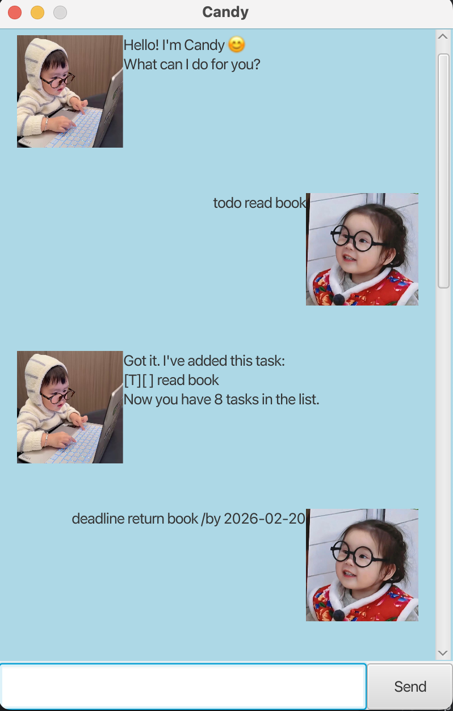

# Candy User Guide 🍬



Candy is a simple task management chatbot application that helps users keep track of their tasks efficiently.

Candy allows you to:
- Add todos
- Add deadlines
- Add events
- List all tasks
- Mark tasks as done
- Unmark tasks
- Delete tasks
- Find tasks
- Sort tasks

---

## Quick Start

1. Download the jar file from the Releases page.
2. Open a terminal in the jar file location.
3. Run:
   ```
   java -jar candy.jar
   ```
4. Type commands into the input box.
5. Press Enter or click **Send** to execute commands.

---

## Features

---

## 1. Listing All Tasks

Displays all tasks in the list.

### Format
```
list
```

### Example
```
list
```

### Expected Result
Displays all tasks currently stored.

---

## 2. Adding a Todo

Adds a simple task to the list.

### Format
```
todo DESCRIPTION
```

### Example
```
todo read book
```

### Expected Result
Adds a new todo task to your task list.

---

## 3. Adding a Deadline

Adds a task with a deadline.

### Format
```
deadline DESCRIPTION /by DATE
```

### Example
```
deadline return book /by 2026-02-20
```

### Expected Result
Adds a deadline task with the specified due date.

---

## 4. Adding an Event

Adds an event with a start and end time.

### Format
```
event DESCRIPTION /from START /to END
```

### Example
```
event project meeting /from Mon 2pm /to Mon 4pm
```

### Expected Result
Adds an event task with the specified time range.

---

## 5. Marking a Task as Done

Marks a task as completed.

### Format
```
mark INDEX
```

### Example
```
mark 2
```

### Expected Result
Marks the specified task as done.

---

## 6. Unmarking a Task

Marks a completed task as not done.

### Format
```
unmark INDEX
```

### Example
```
unmark 2
```

### Expected Result
Marks the specified task as not completed.

---

## 7. Deleting a Task

Deletes a task from the list.

### Format
```
delete INDEX
```

### Example
```
delete 3
```

### Expected Result
Removes the specified task from the list.

---

## 8. Finding Tasks

Searches for tasks containing a keyword.

### Format
```
find KEYWORD
```

### Example
```
find book
```

### Expected Result
Displays all tasks that contain the keyword.

---

## 9. Sorting Tasks

Sorts tasks by deadline priority (earliest deadline first).

### Format
```
sort
```

### Example
```
sort
```

### Expected Result
Displays tasks sorted by earliest deadline first.

---

## 10. Exit the window

For closing the window.

### Format
```
bye
```

### Example
```
bye
```

### Expected Result
Window will close after 3 seconds.

---

## Command Summary

| Command    | Format                                  |
|------------|-----------------------------------------|
| List Tasks | `list`                                  |
| Add Todo   | `todo DESCRIPTION`                      |
| Add Deadline | `deadline DESCRIPTION /by DATE`         |
| Add Event  | `event DESCRIPTION /from START /to END` |
| Mark Task  | `mark INDEX`                            |
| Unmark Task | `unmark INDEX`                          |
| Delete Task | `delete INDEX`                          |
| Find Task  | `find KEYWORD`                          |
| Sort Tasks | `sort`                                  |
| Exit the window | `bye`                                   |

---

Candy helps you stay organised and manage your tasks efficiently. 🎯